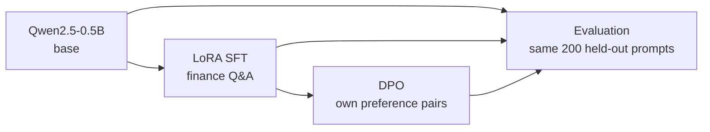

# LLM post-training lab

[](https://github.com/graylayer-labs/llm-post-training-lab/actions/workflows/ci.yml)

A small but complete post-training pipeline for an open LLM: LoRA supervised
fine-tuning, DPO preference optimisation and an evaluation harness. It runs on
one Apple-silicon laptop, so every stage can be taken apart and measured.

## What we found

One run per stage, one seed, `Qwen/Qwen2.5-0.5B` on an Apple M4 with 24 GB.
The write-up is [docs/what-each-stage-changed.md](docs/what-each-stage-changed.md);
the memory and 70B reasoning is [docs/memory-and-scale.md](docs/memory-and-scale.md).

- **SFT taught the model to stop, and moved its answers closer to the
  reference answers (ROUGE-L 0.153 → 0.297).** On 200 held-out prompts the
  base model stops on 39.5% and SFT on 86.5%. It took training
  the two chat-token embedding rows as well as the LoRA: LoRA alone could
  not reach the tied `<|im_end|>` row, and TRL's default loss skipped the
  fix.
- **DPO on 105 home-made pairs cut looping.** Every DPO answer stops. The
  `repetition` pass rate rose from 75.0% to 92.5%, but 15 of 200 answers
  still fail it, and a short loop can stay under the rule's threshold
  ([eval-results.md](docs/eval-results.md#dpo-against-sft), index 29). The
  rubric pass rate rose from 73.0% to 89.0%, and the rejected loops'
  per-token log-prob nearly doubled in cost while the chosen answers barely
  moved.
- **DPO also learned "shorter".** Mean answer length fell from 111.6 to
  51.9 tokens. Even on the 173 prompts SFT already finished, it fell from
  69.1 to 50.4 tokens and ROUGE-L dipped (0.330 to 0.314). The pairs' rejected answers were 2.9 times longer than the
  chosen, so the run cannot separate "do not loop" from "be short".
- **The rubric sees stopping and looping, not correctness.** A wrong
  12-token algebra answer passes every rule. The finance rules rest on 24
  prompts, since only 12.9% of the de-duplicated data is finance. A model
  judge is the stated gap; it was dropped to keep cost inside the existing
  subscription.
- **On a 0.5B model the memory is not the weights.** SFT peaked at 8.10 GiB
  and DPO at 13.19 GiB; the bf16 weights are 0.92 GiB. The rest is
  activations, the 152k-wide logits and the MPS allocator's cache, which
  retained blocks across changing sequence lengths and grew until it was
  emptied every step.
- **At 70B the picture inverts.** Full fine-tuning needs 1.12 TB of state,
  sharded across every GPU and node. LoRA removes the optimiser state and
  keeps the traffic inside a node, at about 36 GB per GPU. That section is
  reasoning, not measurement.

## The problem

Teams want to adapt open LLMs to their own domain data. They usually have no
benchmark for their task. They often have limited or mixed hardware.

That raises three questions this project works through by hand:

- What does supervised fine-tuning change, and what does preference
  optimisation add on top?
- Where does the memory go during training, and what fits on one machine?
- How do you evaluate a model when no off-the-shelf benchmark exists?

## Approach



1. **Base model.** `Qwen/Qwen2.5-0.5B`, the base checkpoint, not Instruct.
2. **LoRA SFT** on 2,000 rows of `gbharti/finance-alpaca`. The loss covers the
   answer only.
3. **DPO** on preference pairs built from the project's own data, with the SFT
   model as reference.
4. **Evaluation** of base, SFT and DPO on the same 200 held-out prompts:
   perplexity, ROUGE-L and a rule-based rubric, with no model judge.
5. **Write-up** of what each stage changed, where the memory went, what
   broke, and how the recipe changes at 70B.

## Why this approach

- **A base model, not Instruct.** An Instruct model already follows the chat
  format and stops. On the base model, the effect of SFT on format and
  stopping is visible.
- **LoRA on one laptop.** The aim is understanding over scale, and a 0.5B
  model on one laptop is enough to show what each stage does. QLoRA is ruled
  out because bitsandbytes 4-bit quantisation is CUDA-only.
- **Loss on the answer only.** The model should learn to answer and to stop.
  It should not learn to reproduce the system prompt and question.
- **Home-made preference pairs.** Real users rarely have preference data, so
  building pairs from the project's own SFT data is the realistic case. It
  also ties the DPO signal to the same rubric the evaluation scores.
- **A rubric, not a public benchmark.** The task has no benchmark, and loss
  metrics miss the failures that matter here. Those are answers that never
  stop, repeat themselves or invent figures. A model judge was dropped to
  keep cost inside the existing subscription, so judged answer quality is a
  stated gap.

The full reasoning, with the alternatives for each choice, is in
[docs/decisions.md](docs/decisions.md).

## Status

Work is tracked in [epic #5](https://github.com/graylayer-labs/llm-post-training-lab/issues/5)
and on the [project board](https://github.com/orgs/graylayer-labs/projects/3).

| Part | Issue | State |
|---|---|---|
| 1. LoRA SFT | [#1](https://github.com/graylayer-labs/llm-post-training-lab/issues/1) | Done. Clean re-run in [#12](https://github.com/graylayer-labs/llm-post-training-lab/issues/12) |
| 2. DPO | [#2](https://github.com/graylayer-labs/llm-post-training-lab/issues/2) | Done. Pairs and DPO run at commit `0263788`; see [docs/dpo-results.md](docs/dpo-results.md) |
| 3. Evaluation harness | [#3](https://github.com/graylayer-labs/llm-post-training-lab/issues/3) | Done. Full run at commit `76c9086`; see [docs/eval-results.md](docs/eval-results.md) |
| 4. Write-up | [#4](https://github.com/graylayer-labs/llm-post-training-lab/issues/4) | Done. [docs/what-each-stage-changed.md](docs/what-each-stage-changed.md) and [docs/memory-and-scale.md](docs/memory-and-scale.md) |

Supporting tasks, all done: run provenance
([#10](https://github.com/graylayer-labs/llm-post-training-lab/issues/10)),
rule-based rubric
([#11](https://github.com/graylayer-labs/llm-post-training-lab/issues/11)),
de-duplicated split
([#15](https://github.com/graylayer-labs/llm-post-training-lab/issues/15)),
stop-token probe
([#19](https://github.com/graylayer-labs/llm-post-training-lab/issues/19)),
crash-safe checkpoints
([#21](https://github.com/graylayer-labs/llm-post-training-lab/issues/21)),
the eval harness code
([#23](https://github.com/graylayer-labs/llm-post-training-lab/issues/23)) and
the pairs and DPO code
([#26](https://github.com/graylayer-labs/llm-post-training-lab/issues/26)). The
follow-along guide is
[#13](https://github.com/graylayer-labs/llm-post-training-lab/issues/13).

## Quickstart

Requires Python 3.12 and [uv](https://docs.astral.sh/uv/). Tested on Apple
silicon (MPS). The code picks CUDA if present, but that path has not been run.
Each stage is one YAML file under `configs/` and one `lab` command, and each
run writes `summary.json` with its commit and library versions to its
`output_dir`.

```bash
uv sync --dev

# Part 1: LoRA SFT. The smoke config trains on 32 rows to check the pipeline.
uv run lab sft --config configs/sft_smoke.yaml
uv run lab sft --config configs/sft.yaml          # about 15 min on an M4

# Part 2: preference pairs from greedy SFT answers, then DPO on them
uv run lab pairs --config configs/pairs.yaml      # about 30 min
uv run lab dpo --config configs/dpo.yaml          # about 20 min

# Part 3: score base, SFT and DPO on the same held-out prompts. A system
# whose adapter is missing is skipped. The smoke config uses 10 prompts.
uv run lab eval --config configs/eval_smoke.yaml
uv run lab eval --config configs/eval.yaml

# Tools: stop-token probe, memory probe, and a CPU comparison of the saved
# eval generations
uv run python tools/stop_token_probe.py outputs/sft
uv run python tools/memory_lora_vs_full.py --mode lora --rank 16
uv run python tools/compare_systems.py outputs/eval/generations \
    --eval-rows outputs/sft/eval_rows.json --out outputs/eval/analysis.json
```

The times are from runs that shared the GPU with other jobs, so treat them
as upper bounds.

Quality gate, as run in CI:

```bash
uv run ruff check . && uv run ruff format --check . && uv run ty check && uv run pytest
```

## Repo layout

```
configs/            one YAML file per run (sft, pairs, dpo, eval and their
                    smoke variants)
src/post_training/
  cli.py            the `lab` command: sft, pairs, dpo, eval
  config.py         typed dataclasses loaded from YAML
  data/finance.py   load, filter, split and render rows as chat messages
  train/sft.py      LoRA SFT with TRL's SFTTrainer
  train/pairs.py    preference pairs from greedy SFT answers and the rubric
  train/dpo.py      DPO on the merged SFT model with TRL's DPOTrainer
  train/checkpoint.py  checkpoint and resume, shared by SFT and DPO
  train/common.py   model loading, memory sampling, cache release
  generate.py       batched, left-padded generation with shared stop tokens
  run.py            run provenance: commit, tree state, library versions
  eval/             rubric, metrics, stop-token probe helper, eval harness
tools/              one-off scripts: generation compare, memory probe,
                    rubric on references, stop-token probe, eval system
                    comparison
tests/              unit tests for config, data, SFT, resume and eval
docs/               decisions and results
outputs/, data/     run outputs and data, gitignored
```

## Further reading

- [docs/what-each-stage-changed.md](docs/what-each-stage-changed.md): the
  write-up. Start here.
- [docs/memory-and-scale.md](docs/memory-and-scale.md): where the memory
  goes, measured against estimated, and the same recipe at 70B.
- [docs/sft-results.md](docs/sft-results.md): Part 1 runs, bugs, memory and
  sample answers.
- [docs/dpo-results.md](docs/dpo-results.md): Part 2 pairs, DPO training and
  the reference model.
- [docs/eval-results.md](docs/eval-results.md): Part 3, what each stage
  changed on the held-out prompts.
- [docs/decisions.md](docs/decisions.md): each choice, the alternatives and
  the reason.
- [INTENT.md](INTENT.md): purpose, standard and how decisions get made.
- [CLAUDE.md](CLAUDE.md): how agents work in this repo.

## Licence

MIT. See [LICENSE](LICENSE).
