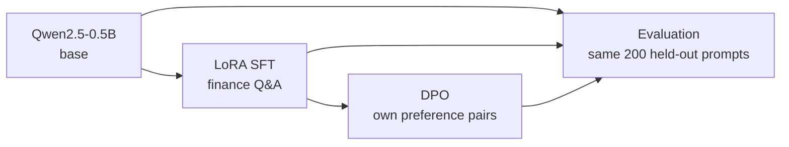

# LLM post-training lab

[](https://github.com/graylayer-labs/llm-post-training-lab/actions/workflows/ci.yml)

A small but complete post-training pipeline for an open LLM: LoRA supervised
fine-tuning, DPO preference optimisation and an evaluation harness. It runs on
one Apple-silicon laptop, so every stage can be taken apart and measured.

## The problem

Teams want to adapt open LLMs to their own domain data. They usually have no
benchmark for their task. They often have limited or mixed hardware.

That raises three questions this project works through by hand:

- What does supervised fine-tuning change, and what does preference
  optimisation add on top?
- Where does the memory go during training, and what fits on one machine?
- How do you evaluate a model when no off-the-shelf benchmark exists?

## Approach



1. **Base model.** `Qwen/Qwen2.5-0.5B`, the base checkpoint, not Instruct.
2. **LoRA SFT** on 2,000 rows of `gbharti/finance-alpaca`. The loss covers the
   answer only.
3. **DPO** on preference pairs built from the project's own data, with the SFT
   model as reference.
4. **Evaluation** of base, SFT and DPO on the same 200 held-out prompts:
   perplexity, ROUGE-L and a rule-based rubric, with no model judge. The
   harness is built; the full run is pending.

## Why this approach

- **A base model, not Instruct.** An Instruct model already follows the chat
  format and stops. On the base model, the effect of SFT on format and
  stopping is visible.
- **LoRA on one laptop.** The aim is understanding over scale, and a 0.5B
  model on one laptop is enough to show what each stage does. QLoRA is ruled
  out because bitsandbytes 4-bit quantisation is CUDA-only.
- **Loss on the answer only.** The model should learn to answer and to stop.
  It should not learn to reproduce the system prompt and question.
- **Home-made preference pairs.** Real users rarely have preference data, so
  building pairs from the project's own SFT data is the realistic case. It
  also ties the DPO signal to the same rubric the evaluation scores.
- **A rubric, not a public benchmark.** The task has no benchmark, and loss
  metrics miss the failures that matter here. Those are answers that never
  stop, repeat themselves or invent figures. A model judge was dropped to
  keep cost inside the existing subscription, so judged answer quality is a
  stated gap.

The full reasoning, with the alternatives for each choice, is in
[docs/decisions.md](docs/decisions.md).

## Status

Work is tracked in [epic #5](https://github.com/graylayer-labs/llm-post-training-lab/issues/5)
and on the [project board](https://github.com/orgs/graylayer-labs/projects/3).

| Part | Issue | State |
|---|---|---|
| 1. LoRA SFT | [#1](https://github.com/graylayer-labs/llm-post-training-lab/issues/1) | Done. Clean re-run in [#12](https://github.com/graylayer-labs/llm-post-training-lab/issues/12) |
| 2. DPO | [#2](https://github.com/graylayer-labs/llm-post-training-lab/issues/2) | Done. Pairs and DPO run at commit `0263788`; see [docs/dpo-results.md](docs/dpo-results.md) |
| 3. Evaluation harness | [#3](https://github.com/graylayer-labs/llm-post-training-lab/issues/3) | Harness built (#23); full three-system run in progress |
| 4. Write-up | [#4](https://github.com/graylayer-labs/llm-post-training-lab/issues/4) | Not started |

Supporting tasks, all done: run provenance
([#10](https://github.com/graylayer-labs/llm-post-training-lab/issues/10)),
rule-based rubric
([#11](https://github.com/graylayer-labs/llm-post-training-lab/issues/11)),
de-duplicated split
([#15](https://github.com/graylayer-labs/llm-post-training-lab/issues/15)),
stop-token probe
([#19](https://github.com/graylayer-labs/llm-post-training-lab/issues/19)),
crash-safe checkpoints
([#21](https://github.com/graylayer-labs/llm-post-training-lab/issues/21)),
the eval harness code
([#23](https://github.com/graylayer-labs/llm-post-training-lab/issues/23)) and
the pairs and DPO code
([#26](https://github.com/graylayer-labs/llm-post-training-lab/issues/26)). The
follow-along guide is
[#13](https://github.com/graylayer-labs/llm-post-training-lab/issues/13).

## Results so far

Part 1, LoRA SFT: one run, one seed, on an Apple M4 laptop (MPS), at commit
`76739e6` on a clean tree with a de-duplicated split. Full detail is in
[docs/sft-results.md](docs/sft-results.md).

| | Value |
|---|---|
| Trainable parameters | 8.8M of 494M (1.78%) |
| Eval loss, 200 held-out answers | 2.169 before, 1.714 after |
| Wall time, 1 epoch | 1,282.7 s (GPU shared with other jobs, so contended) |
| Peak MPS memory, sampled per step (approximate) | 8.10 GB |
| Stop token ranked first at the end of a reference answer | base 0.00, SFT 0.795 (200 rows) |

- The base model almost never predicts the stop token at the end of an
  answer: its median rank for `<|im_end|>` is 123,031 of about 152,000.
  After SFT the median rank is 1. SFT taught the model to close its turn, but
  only once the chat-token embedding rows were trained as well as the LoRA
  adapters.
- Training ran out of memory until the MPS allocator cache was emptied after
  every step.
- SFT answers still fall into repetition loops in the Part 1 samples. The
  re-run has no generated answers yet; the eval harness will score them.

Part 2, DPO, at commit `0263788`: one run, one seed, 105 preference pairs.
These figures are on 10 held-out *pairs* drawn from training prompts, a
check that DPO fits the pairs. They are not the evaluation, which is
[#3](https://github.com/graylayer-labs/llm-post-training-lab/issues/3).
Full detail is in [docs/dpo-results.md](docs/dpo-results.md).

- DPO loss on the 10 held-out pairs fell from 0.693 to 0.058.
- On those pairs the rejected answers' log-probability fell (summed,
  -64.718 to -123.960) while the chosen answers' barely moved (-281.671
  to -286.481). DPO lowered the loops rather than pushing both answers
  down.

## Quickstart

Requires Python 3.12 and [uv](https://docs.astral.sh/uv/). Tested on Apple
silicon (MPS). The code picks CUDA if present, but that path has not been run.

```bash
uv sync --dev

# Part 1: LoRA SFT. The smoke config trains on 32 rows to check the pipeline.
uv run lab sft --config configs/sft_smoke.yaml
uv run lab sft --config configs/sft.yaml          # about 15 min on an M4

# Compare greedy answers from base and base + adapter on held-out prompts
uv run python tools/compare_generations.py outputs/sft -n 5

# Part 3: score base, SFT and DPO on the held-out prompts. A system whose
# adapter is missing is skipped. The smoke config uses 10 prompts.
uv run lab eval --config configs/eval_smoke.yaml
uv run lab eval --config configs/eval.yaml

# Peak memory for 8 steps: LoRA at any rank, or a full fine-tune
uv run python tools/memory_lora_vs_full.py --mode lora --rank 16
uv run python tools/memory_lora_vs_full.py --mode full
```

Part 2 builds preference pairs from greedy SFT answers, then trains DPO on
them:

```bash
uv run lab pairs --config configs/pairs.yaml
uv run lab dpo --config configs/dpo.yaml
```

Each run writes `summary.json`, the eval rows and the adapter to its
`output_dir`.

Quality gate, as run in CI:

```bash
uv run ruff check . && uv run ruff format --check . && uv run ty check && uv run pytest
```

## Repo layout

```
configs/            one YAML file per run (sft, pairs, dpo, eval and their
                    smoke variants)
src/post_training/
  cli.py            the `lab` command: sft, pairs, dpo, eval
  config.py         typed dataclasses loaded from YAML
  data/finance.py   load, filter, split and render rows as chat messages
  train/sft.py      LoRA SFT with TRL's SFTTrainer
  train/pairs.py    preference pairs from greedy SFT answers and the rubric
  train/dpo.py      DPO on the merged SFT model with TRL's DPOTrainer
  train/checkpoint.py  checkpoint and resume, shared by SFT and DPO
  train/common.py   model loading, memory sampling, cache release
  generate.py       batched, left-padded generation with shared stop tokens
  run.py            run provenance: commit, tree state, library versions
  eval/             rubric, metrics, stop-token probe helper, eval harness
tools/              one-off scripts: generation compare, memory probe,
                    rubric on references, stop-token probe
tests/              unit tests for config, data, SFT, resume and eval
docs/               decisions and results
outputs/, data/     run outputs and data, gitignored
```

## Further reading

- [INTENT.md](INTENT.md): purpose, standard and how decisions get made.
- [docs/decisions.md](docs/decisions.md): each choice, the alternatives and
  the reason.
- [docs/sft-results.md](docs/sft-results.md): Part 1 runs, bugs, memory and
  sample answers.
- [CLAUDE.md](CLAUDE.md): how agents work in this repo.

## Licence

MIT. See [LICENSE](LICENSE).
