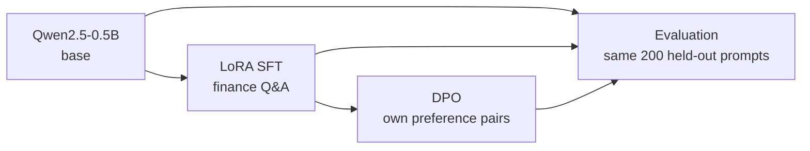

# LLM post-training lab

[](https://github.com/graylayer-labs/llm-post-training-lab/actions/workflows/ci.yml)

A small but complete post-training pipeline for an open LLM: LoRA supervised
fine-tuning, DPO preference optimisation and an evaluation harness. It runs on
one Apple-silicon laptop, so every stage can be taken apart and measured.

## The problem

Teams want to adapt open LLMs to their own domain data. They usually have no
benchmark for their task. They often have limited or mixed hardware.

That raises three questions this project works through by hand:

- What does supervised fine-tuning change, and what does preference
  optimisation add on top?
- Where does the memory go during training, and what fits on one machine?
- How do you evaluate a model when no off-the-shelf benchmark exists?

## Approach



1. **Base model.** `Qwen/Qwen2.5-0.5B`, the base checkpoint, not Instruct.
2. **LoRA SFT** on 2,000 rows of `gbharti/finance-alpaca`. The loss covers the
   answer only.
3. **DPO** on preference pairs built from the project's own data, with the SFT
   model as reference. Planned.
4. **Evaluation** of base, SFT and DPO on the same 200 held-out prompts:
   perplexity, ROUGE-L, a rule-based rubric and a pairwise Claude judge.
   Planned.

## Status

Work is tracked in [epic #5](https://github.com/graylayer-labs/llm-post-training-lab/issues/5)
and on the [project board](https://github.com/orgs/graylayer-labs/projects/3).

| Part | Issue | State |
|---|---|---|
| 1. LoRA SFT | [#1](https://github.com/graylayer-labs/llm-post-training-lab/issues/1) | Run recorded; PR not yet merged |
| 2. DPO | [#2](https://github.com/graylayer-labs/llm-post-training-lab/issues/2) | Not started |
| 3. Evaluation harness | [#3](https://github.com/graylayer-labs/llm-post-training-lab/issues/3) | Not started |
| 4. Write-up | [#4](https://github.com/graylayer-labs/llm-post-training-lab/issues/4) | Not started |

## Results so far

Part 1 only. One run, one seed, on an Apple M4 laptop (MPS).
Full detail is in [docs/sft-results.md](docs/sft-results.md).

| | Value |
|---|---|
| Trainable parameters | 8.8M of 494M (1.78%) |
| Eval loss, 200 held-out answers | 2.28 before, 1.83 after |
| Wall time, 1 epoch | 854 s |
| Peak MPS memory, sampled per step (approximate) | 8.53 GB |
| Answers that end on a stop token, 5 samples | base 2 of 5, SFT 4 of 5 |

- The base model often runs on to the token limit. SFT taught it to close its
  turn, but only once the chat-token embedding rows were trained as well as
  the LoRA adapters.
- Training ran out of memory until the MPS allocator cache was emptied after
  every step.
- SFT answers still fall into repetition loops. No rubric or judge scores
  exist yet, so answer quality is not measured.

## Quickstart

Requires Python 3.12 and [uv](https://docs.astral.sh/uv/). Tested on Apple
silicon (MPS). The code picks CUDA if present, but that path has not been run.

```bash
uv sync --dev

# Part 1: LoRA SFT. The smoke config trains on 32 rows to check the pipeline.
uv run lab sft --config configs/sft_smoke.yaml
uv run lab sft --config configs/sft.yaml          # about 15 min on an M4

# Compare greedy answers from base and base + adapter on held-out prompts
uv run python tools/compare_generations.py outputs/sft -n 5

# Peak memory for 8 steps: LoRA at any rank, or a full fine-tune
uv run python tools/memory_lora_vs_full.py --mode lora --rank 16
uv run python tools/memory_lora_vs_full.py --mode full
```

`lab dpo` and `lab eval` exist as commands but exit with "not implemented
yet" until Parts 2 and 3 land.

Each run writes `summary.json`, the eval rows and the adapter to its
`output_dir`.

Quality gate, as run in CI:

```bash
uv run ruff check . && uv run ruff format --check . && uv run ty check && uv run pytest
```

## Repo layout

```
configs/            one YAML file per run (sft.yaml, sft_smoke.yaml)
src/post_training/
  cli.py            the `lab` command: sft, dpo, eval
  config.py         typed dataclasses loaded from YAML
  data/finance.py   load, filter, split and render rows as chat messages
  train/sft.py      LoRA SFT with TRL's SFTTrainer
  train/common.py   model loading, memory sampling, cache release
  eval/             evaluation harness (Part 3, empty so far)
tools/              one-off analysis scripts
tests/              unit tests for config, data and SFT setup
docs/               decisions and results
outputs/, data/     run outputs and data, gitignored
```

## Further reading

- [INTENT.md](INTENT.md): purpose, standard and how decisions get made.
- [docs/decisions.md](docs/decisions.md): each choice, the alternatives and
  the reason.
- [docs/sft-results.md](docs/sft-results.md): Part 1 runs, bugs, memory and
  sample answers.
- [CLAUDE.md](CLAUDE.md): how agents work in this repo.

## Licence

MIT. See [LICENSE](LICENSE).
